# BIZARRE INDUSTRIES - Editor, Terminal, Shell, And Tool Themes

`BZR / THEMES / V0.2 / MAY 2026`

A generated theming bundle for editors, terminals, shells, prompts, window managers, and desktop tools. One palette, five variants, GitHub Monaspace typography, and one rule: CATCH THE STARS.

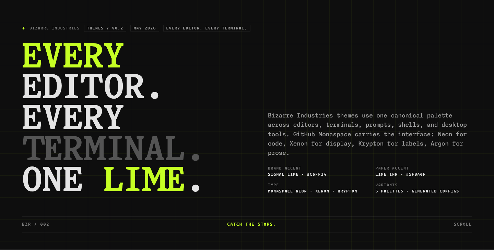

## Showcase

Open [showcase/index.html](showcase/index.html) locally for the interactive preview. The README images below are rendered from that same showcase and from local app captures.

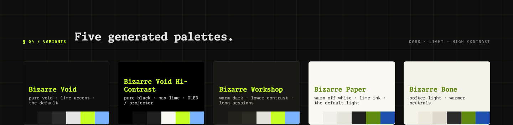

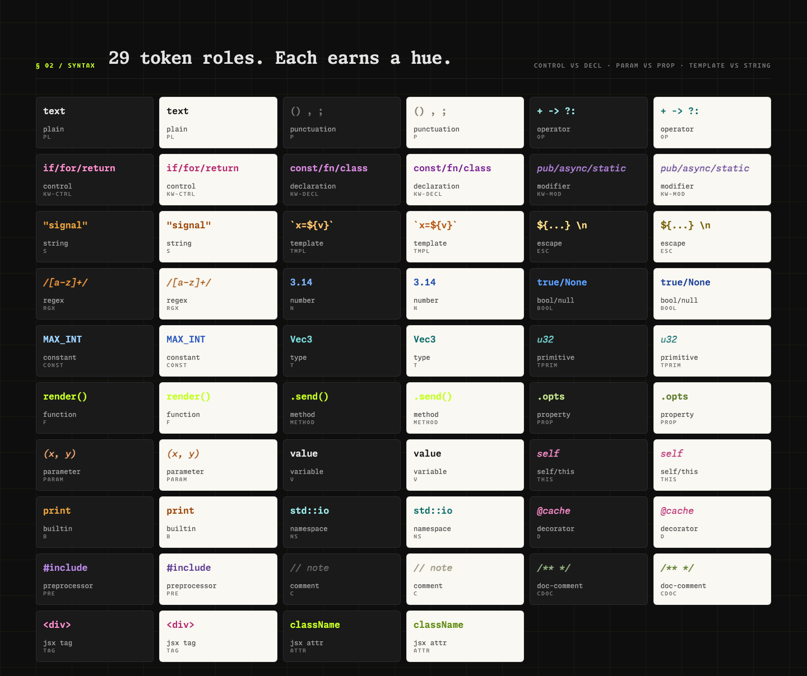

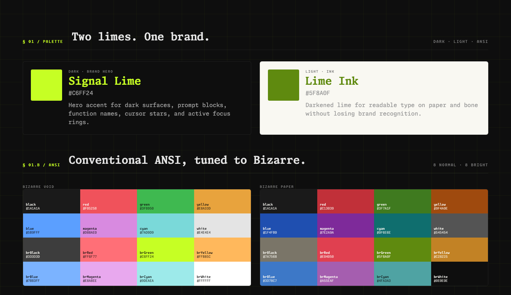

## Applied Local Screenshots

These are real local captures using one installed target per category, with temporary profiles and generated configs applied directly.

| Editor | Terminal |
|---|---|
| 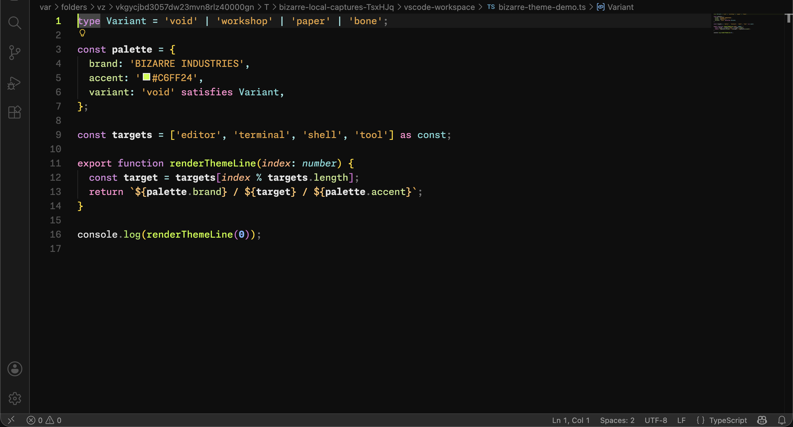 | 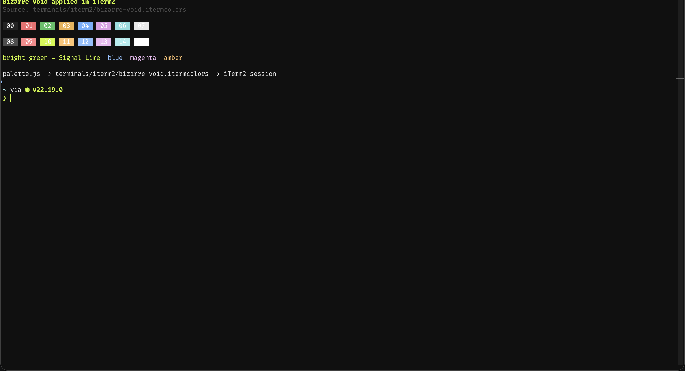 |

| Shell | Prompt / Tool |
|---|---|
| 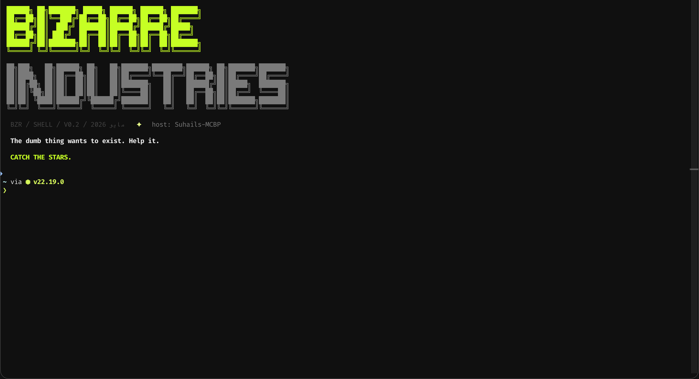 | 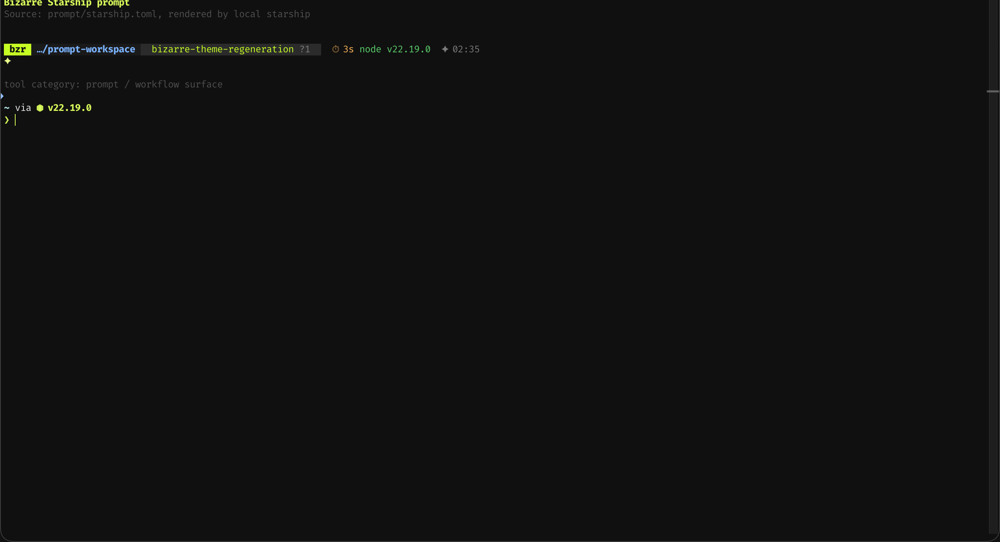 |

## Generated Coverage Cards

Every shipped target still gets a generated preview card in `showcase/assets/generated/`. These family sheets are rendered from [showcase/index.html](showcase/index.html) and show coverage without installing every app.

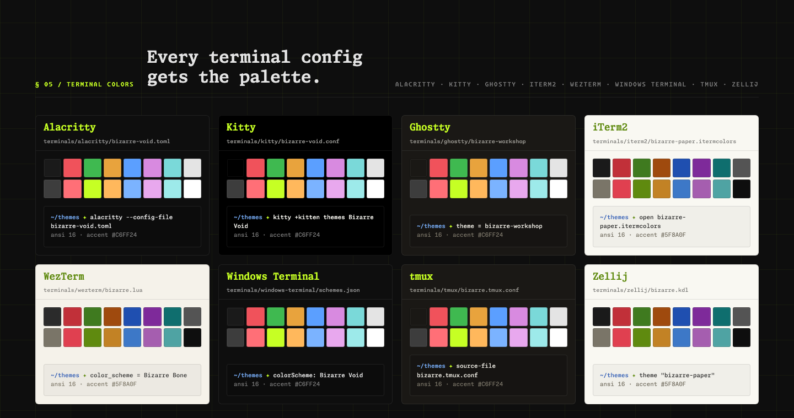

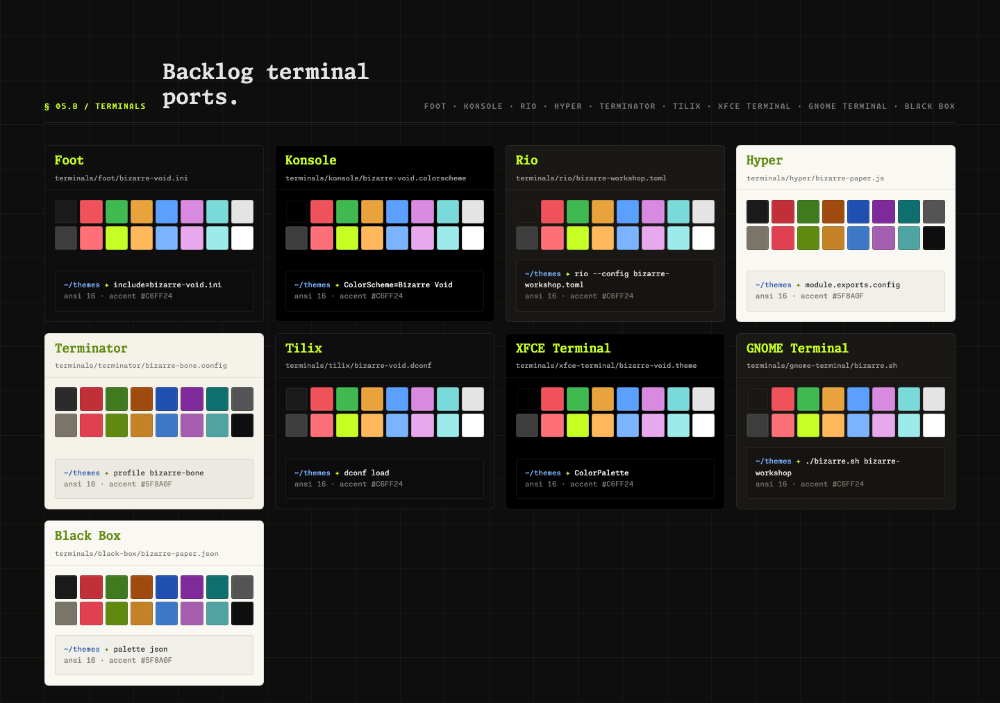

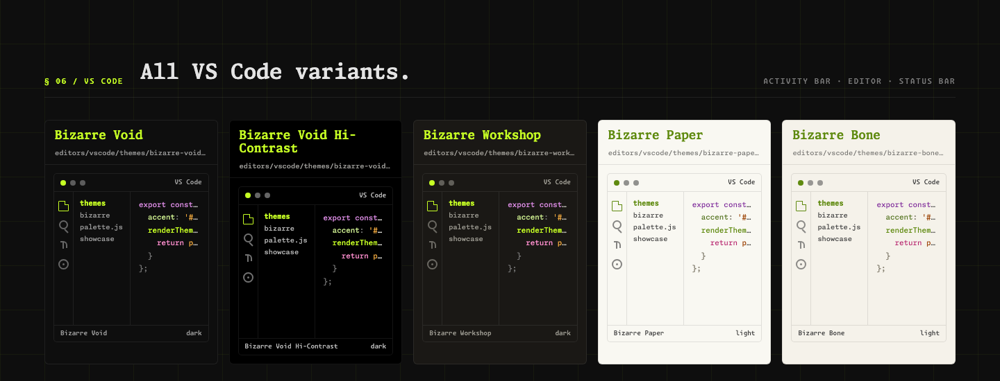

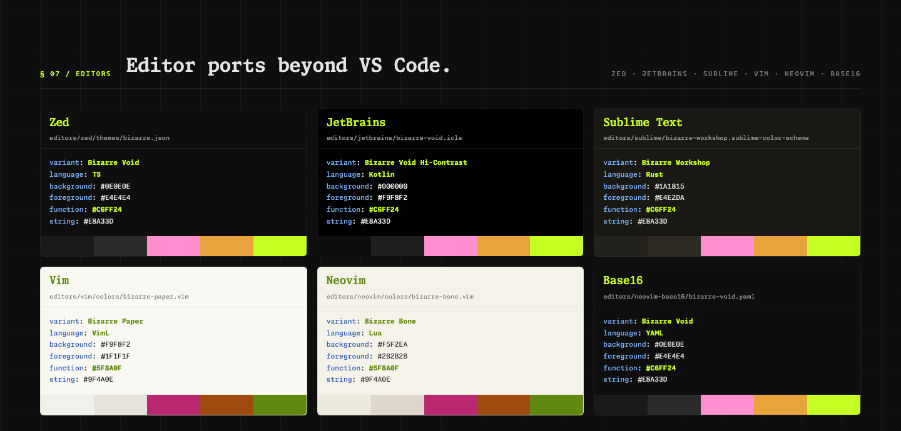

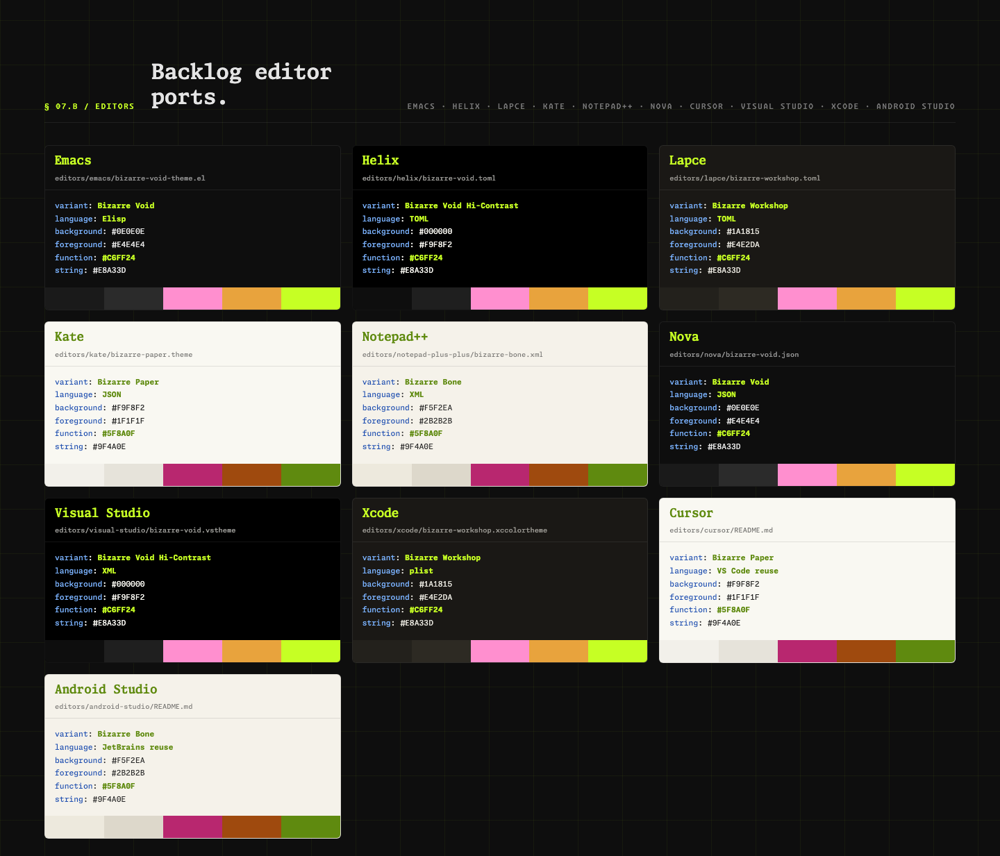

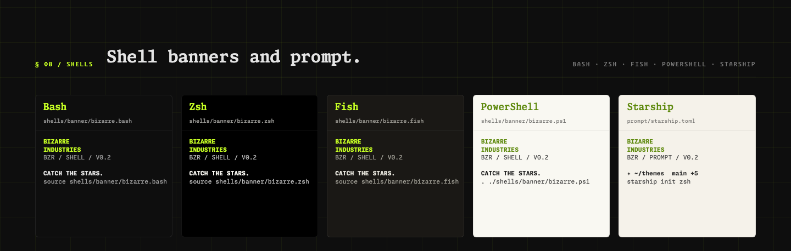

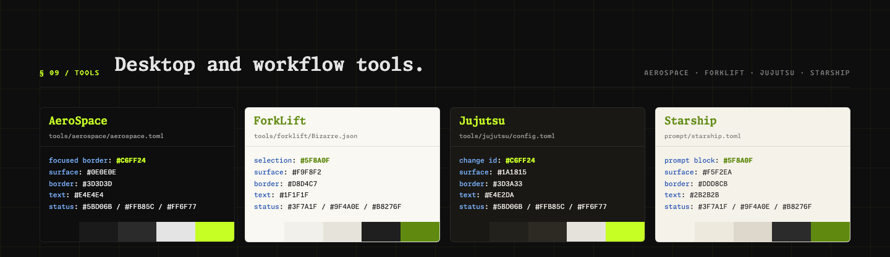

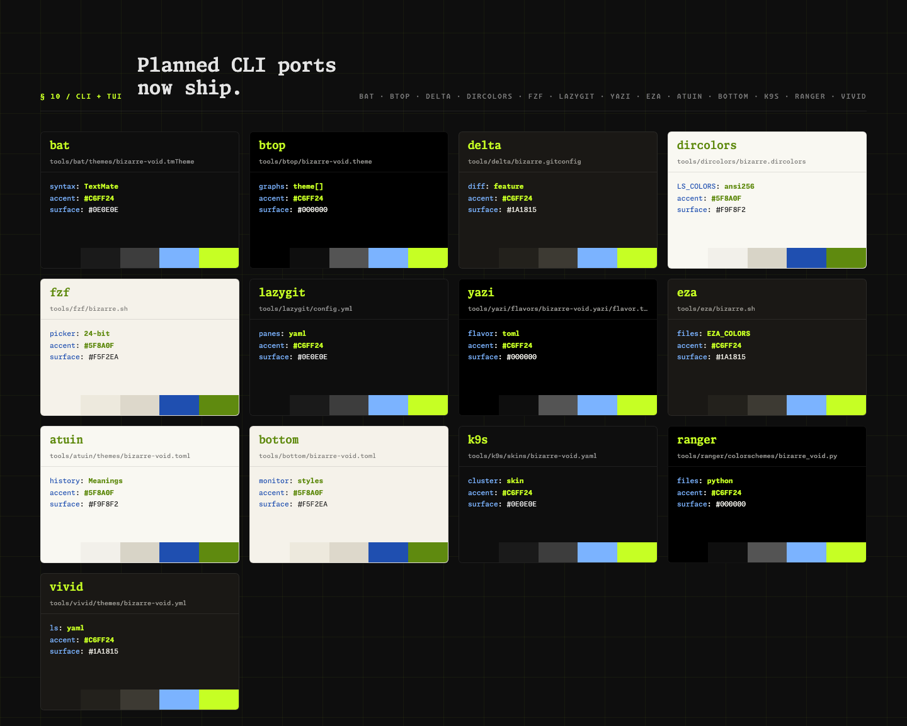

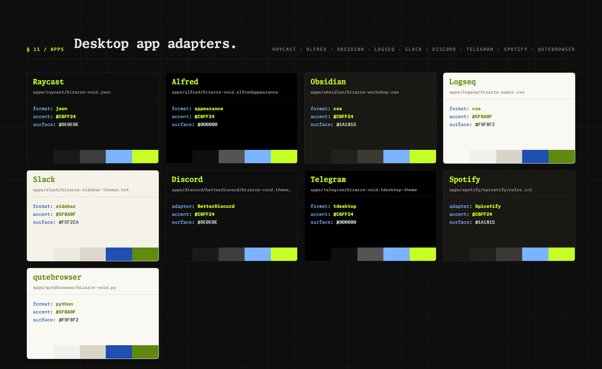

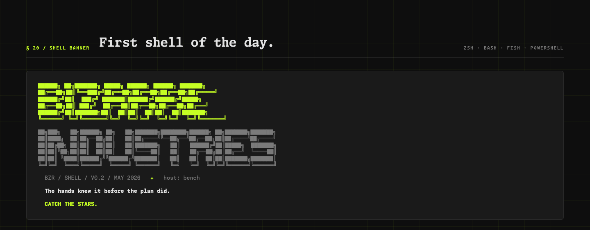

## Install Examples

```bash
# Generate every config from palette.js
npm run generate

# Render README screenshots
npm run render:showcase

# Verify generated files are current
npm test

# Starship prompt
cp prompt/starship.toml ~/.config/starship.toml

# Kitty
cp terminals/kitty/bizarre-void.conf ~/.config/kitty/themes/

# Alacritty
mkdir -p ~/.config/alacritty/themes
cp terminals/alacritty/*.toml ~/.config/alacritty/themes/

# Ghostty
cp terminals/ghostty/bizarre-void ~/.config/ghostty/themes/

# WezTerm
mkdir -p ~/.config/wezterm
cp terminals/wezterm/bizarre.lua ~/.config/wezterm/bizarre.lua
# then in wezterm.lua: return require('bizarre')

# Neovim
ln -s "$PWD/editors/neovim" ~/.config/nvim/pack/bizarre/start/bizarre.nvim
# then in init.lua: vim.cmd.colorscheme('bizarre-void')

# Vim
mkdir -p ~/.vim/colors
cp editors/vim/colors/*.vim ~/.vim/colors/

# Zed
mkdir -p ~/.config/zed/themes
cp editors/zed/themes/bizarre.json ~/.config/zed/themes/

# JetBrains
# import editors/jetbrains/bizarre-void.icls from Settings > Editor > Color Scheme

# Sublime Text
mkdir -p "$HOME/Library/Application Support/Sublime Text/Packages/User"
cp editors/sublime/*.sublime-color-scheme "$HOME/Library/Application Support/Sublime Text/Packages/User/"

# Emacs
mkdir -p ~/.emacs.d/themes
cp editors/emacs/*-theme.el ~/.emacs.d/themes/

# Helix
mkdir -p ~/.config/helix/themes
cp editors/helix/*.toml ~/.config/helix/themes/

# Lapce
mkdir -p ~/.local/share/lapce-stable/themes
cp editors/lapce/*.toml ~/.local/share/lapce-stable/themes/

# Kate
mkdir -p ~/.local/share/org.kde.syntax-highlighting/themes
cp editors/kate/*.theme ~/.local/share/org.kde.syntax-highlighting/themes/

# Notepad++
# copy editors/notepad-plus-plus/*.xml into the Notepad++ themes directory

# Nova
# import or copy editors/nova/*.json into Nova's extension/theme workspace

# Cursor
# use the VS Code extension in editors/vscode; see editors/cursor/README.md

# Visual Studio
# import editors/visual-studio/*.vstheme through Visual Studio theme tooling

# Xcode
mkdir -p ~/Library/Developer/Xcode/UserData/FontAndColorThemes
cp editors/xcode/*.xccolortheme ~/Library/Developer/Xcode/UserData/FontAndColorThemes/

# Android Studio
# use the JetBrains schemes in editors/jetbrains; see editors/android-studio/README.md

# tmux
echo 'source-file ~/dotfiles/bizarre/terminals/tmux/bizarre.tmux.conf' >> ~/.tmux.conf

# VS Code
ln -s "$PWD/editors/vscode" ~/.vscode/extensions/bizarre-industries.bizarre-themes

# iTerm2
open terminals/iterm2/bizarre-void.itermcolors

# Zellij
mkdir -p ~/.config/zellij/themes
cp terminals/zellij/bizarre.kdl ~/.config/zellij/themes/

# Windows Terminal
# paste terminals/windows-terminal/schemes.json schemes into settings.json

# Foot
mkdir -p ~/.config/foot/themes
cp terminals/foot/*.ini ~/.config/foot/themes/

# Konsole
mkdir -p ~/.local/share/konsole
cp terminals/konsole/*.colorscheme ~/.local/share/konsole/

# Rio
mkdir -p ~/.config/rio/themes
cp terminals/rio/*.toml ~/.config/rio/themes/

# Hyper
# merge one terminals/hyper/bizarre-*.js config object into ~/.hyper.js

# Terminator
# merge one terminals/terminator/bizarre-*.config profile into ~/.config/terminator/config

# Tilix
# import one terminals/tilix/bizarre-*.dconf with dconf load

# XFCE Terminal
mkdir -p ~/.local/share/xfce4/terminal/colorschemes
cp terminals/xfce-terminal/*.theme ~/.local/share/xfce4/terminal/colorschemes/

# GNOME Terminal
bash terminals/gnome-terminal/bizarre.sh bizarre-void

# Black Box
# import or adapt terminals/black-box/*.json through Black Box palette settings

# Shell banners
echo "source $PWD/shells/banner/bizarre.bash" >> ~/.bashrc
echo "source $PWD/shells/banner/bizarre.zsh" >> ~/.zshrc
echo "source $PWD/shells/banner/bizarre.fish" >> ~/.config/fish/config.fish
# PowerShell: dot-source shells/banner/bizarre.ps1 from your profile

# AeroSpace
mkdir -p ~/.config/aerospace
cp tools/aerospace/aerospace.toml ~/.config/aerospace/aerospace.toml

# ForkLift
# import tools/forklift/Bizarre.json through ForkLift theme preferences

# Jujutsu
mkdir -p ~/.config/jj
cp tools/jujutsu/config.toml ~/.config/jj/config.toml

# bat
mkdir -p "$(bat --config-dir)/themes"
cp tools/bat/themes/*.tmTheme "$(bat --config-dir)/themes/"
bat cache --build

# btop
mkdir -p ~/.config/btop/themes
cp tools/btop/*.theme ~/.config/btop/themes/
# then set color_theme = "bizarre-void" in ~/.config/btop/btop.conf

# delta
# add tools/delta/bizarre.gitconfig to your ~/.gitconfig [include] path
# then set [delta] features = bizarre-void

# dircolors
eval "$(dircolors tools/dircolors/bizarre.dircolors)"

# fzf
source tools/fzf/bizarre.sh

# lazygit
# merge tools/lazygit/config.yml into ~/.config/lazygit/config.yml

# Yazi
mkdir -p ~/.config/yazi/flavors
cp -R tools/yazi/flavors/*.yazi ~/.config/yazi/flavors/
# then set [flavor] dark = "bizarre-void" in ~/.config/yazi/theme.toml

# eza
source tools/eza/bizarre.sh

# Atuin
mkdir -p ~/.config/atuin/themes
cp tools/atuin/themes/*.toml ~/.config/atuin/themes/
# then set [theme] name = "bizarre-void" in ~/.config/atuin/config.toml

# bottom
# merge one tools/bottom/bizarre-*.toml into ~/.config/bottom/bottom.toml

# K9s
mkdir -p ~/.config/k9s/skins
cp tools/k9s/skins/*.yaml ~/.config/k9s/skins/
# then set skin: bizarre-void in ~/.config/k9s/config.yaml

# ranger
mkdir -p ~/.config/ranger/colorschemes
cp tools/ranger/colorschemes/*.py ~/.config/ranger/colorschemes/
# then set colorscheme bizarre_void in ~/.config/ranger/rc.conf

# vivid
mkdir -p ~/.config/vivid/themes
cp tools/vivid/themes/*.yml ~/.config/vivid/themes/
# then export LS_COLORS="$(vivid generate bizarre-void)"

# Raycast
# import apps/raycast/*.json through Raycast theme preferences

# Alfred
# import apps/alfred/*.alfredappearance through Alfred appearance preferences

# Obsidian
# copy apps/obsidian/*.css into your vault .obsidian/themes directory

# Logseq
# copy one apps/logseq/bizarre-*.css into custom.css or merge its variables

# Slack
# paste one line from apps/slack/bizarre-sidebar-themes.txt into Slack sidebar theme settings

# Discord
# BetterDiscord adapter: copy apps/discord/betterdiscord/*.theme.css into the BetterDiscord themes folder

# Telegram
# import apps/telegram/*.tdesktop-theme through Telegram Desktop theme settings

# Spotify
# Spicetify adapter: copy apps/spotify/spicetify/color.ini and user.css into a Spicetify theme directory

# qutebrowser
# source one apps/qutebrowser/bizarre-*.py from qutebrowser config.py
```

## Current Coverage

| Family | Targets |
|---|---|
| Editors | VS Code, Zed, JetBrains, Sublime Text, Vim, Neovim, Neovim Base16, Emacs, Helix, Lapce, Kate, Notepad++, Nova, Cursor, Visual Studio, Xcode, Android Studio |
| Terminals | Alacritty, Kitty, WezTerm, iTerm2, Ghostty, Windows Terminal, tmux, Zellij, Foot, Konsole, Rio, Hyper, Terminator, Tilix, XFCE Terminal, GNOME Terminal, Black Box |
| Shells and prompt | Bash, Zsh, Fish, PowerShell, Starship |
| CLI/TUI | bat, btop, delta, dircolors, fzf, lazygit, yazi, eza, atuin, bottom, k9s, ranger, vivid |
| Desktop apps | Raycast, Alfred, Obsidian, Logseq, Slack, Discord, Telegram, Spotify, qutebrowser |
| Tools | AeroSpace, ForkLift, Jujutsu |

## Variants

| Variant | Mood |
|---|---|
| Bizarre Void | pure void · lime accent · the default |
| Bizarre Void Hi-Contrast | pure black · max lime · OLED / projector |
| Bizarre Workshop | warm dark · lower contrast · long sessions |
| Bizarre Paper | warm off-white · lime ink · the default light |
| Bizarre Bone | softer light · warmer neutrals |

## Source Of Truth

- Palette: [palette.js](palette.js)
- Palette spec: [PALETTE.md](PALETTE.md)
- Port roadmap: [PORTS.md](PORTS.md)

Signal Lime is reserved for functions, cursors, focus rings, and active command surfaces. Light variants use Lime Ink where raw Signal Lime would fail as text.
