# BIZARRE INDUSTRIES - Editor, Terminal, Shell, And Tool Themes

`BZR / THEMES / V0.2 / MAY 2026`

A generated theming bundle for editors, terminals, shells, prompts, window managers, and desktop tools. One palette, five variants, GitHub Monaspace typography, and one rule: CATCH THE STARS.


## Showcase

Open [showcase/index.html](showcase/index.html) locally for the interactive preview. The README images below are rendered from that same showcase.


## Config Screenshots

Every shipped target gets a generated preview card in `showcase/assets/generated/`. These family sheets are rendered from [showcase/index.html](showcase/index.html).


## Per-Target Screenshots

### Terminals

| Alacritty | Kitty | Ghostty | iTerm2 |
|---|---|---|---|
| 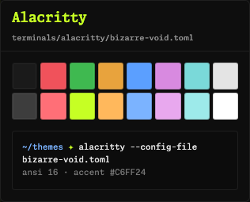 | 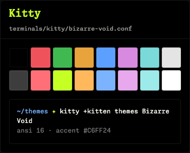 | 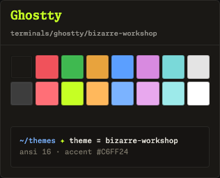 | 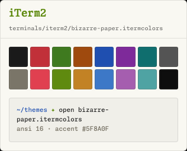 |

| WezTerm | Windows Terminal | tmux | Zellij |
|---|---|---|---|
| 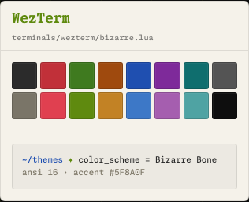 | 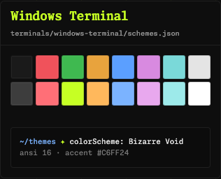 | 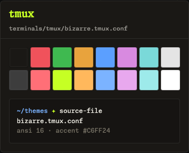 | 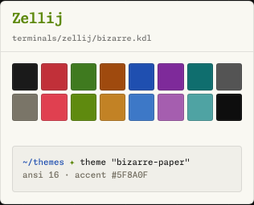 |

### VS Code

| Void | Void Hi-Contrast | Workshop | Paper | Bone |
|---|---|---|---|---|
| 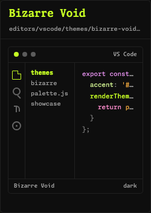 | 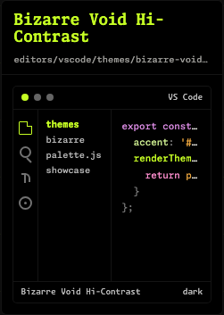 | 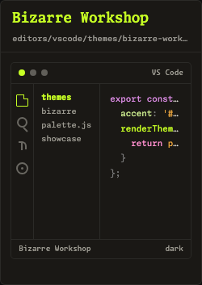 | 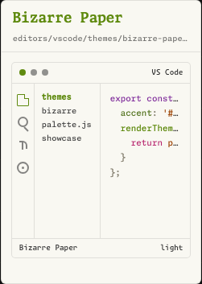 | 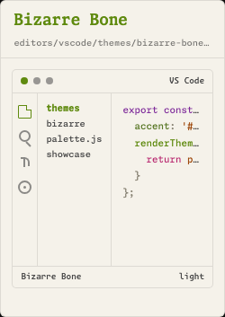 |

### Editors

| Zed | JetBrains | Sublime Text |
|---|---|---|
| 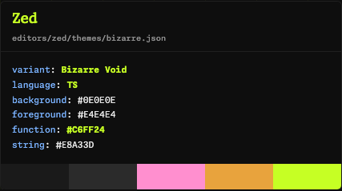 | 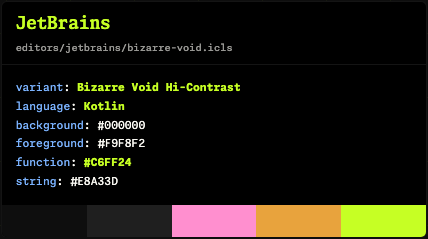 | 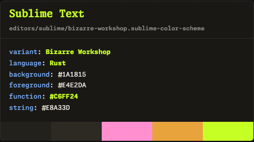 |

| Vim | Neovim | Base16 |
|---|---|---|
| 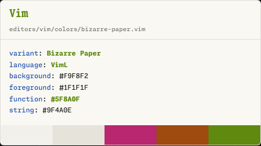 | 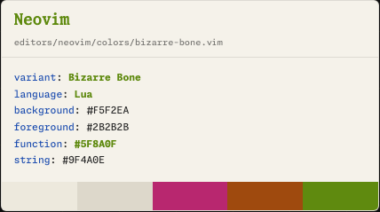 | 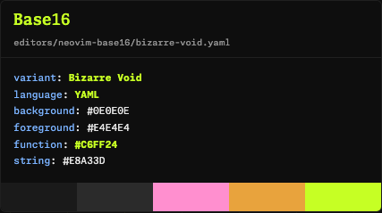 |

### Shells And Prompt

| Bash | Zsh | Fish | PowerShell | Starship |
|---|---|---|---|---|
| 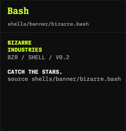 | 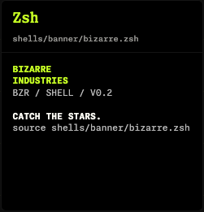 | 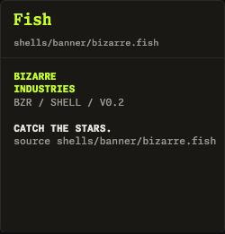 | 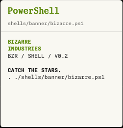 | 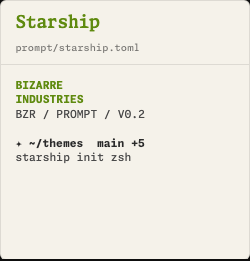 |

### Tools

| AeroSpace | ForkLift | Jujutsu | Starship |
|---|---|---|---|
| 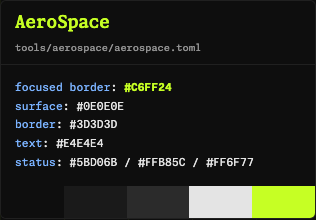 | 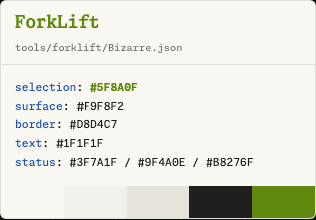 | 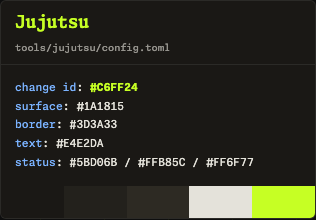 | 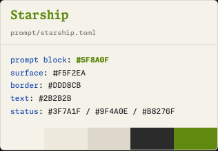 |

## Install Examples

```bash
# Generate every config from palette.js
npm run generate

# Render README screenshots
npm run render:showcase

# Verify generated files are current
npm test

# Starship prompt
cp prompt/starship.toml ~/.config/starship.toml

# Kitty
cp terminals/kitty/bizarre-void.conf ~/.config/kitty/themes/

# Alacritty
mkdir -p ~/.config/alacritty/themes
cp terminals/alacritty/*.toml ~/.config/alacritty/themes/

# Ghostty
cp terminals/ghostty/bizarre-void ~/.config/ghostty/themes/

# WezTerm
mkdir -p ~/.config/wezterm
cp terminals/wezterm/bizarre.lua ~/.config/wezterm/bizarre.lua
# then in wezterm.lua: return require('bizarre')

# Neovim
ln -s "$PWD/editors/neovim" ~/.config/nvim/pack/bizarre/start/bizarre.nvim
# then in init.lua: vim.cmd.colorscheme('bizarre-void')

# Vim
mkdir -p ~/.vim/colors
cp editors/vim/colors/*.vim ~/.vim/colors/

# Zed
mkdir -p ~/.config/zed/themes
cp editors/zed/themes/bizarre.json ~/.config/zed/themes/

# JetBrains
# import editors/jetbrains/bizarre-void.icls from Settings > Editor > Color Scheme

# Sublime Text
mkdir -p "$HOME/Library/Application Support/Sublime Text/Packages/User"
cp editors/sublime/*.sublime-color-scheme "$HOME/Library/Application Support/Sublime Text/Packages/User/"

# tmux
echo 'source-file ~/dotfiles/bizarre/terminals/tmux/bizarre.tmux.conf' >> ~/.tmux.conf

# VS Code
ln -s "$PWD/editors/vscode" ~/.vscode/extensions/bizarre-industries.bizarre-themes

# iTerm2
open terminals/iterm2/bizarre-void.itermcolors

# Zellij
mkdir -p ~/.config/zellij/themes
cp terminals/zellij/bizarre.kdl ~/.config/zellij/themes/

# Windows Terminal
# paste terminals/windows-terminal/schemes.json schemes into settings.json

# Shell banners
echo "source $PWD/shells/banner/bizarre.bash" >> ~/.bashrc
echo "source $PWD/shells/banner/bizarre.zsh" >> ~/.zshrc
echo "source $PWD/shells/banner/bizarre.fish" >> ~/.config/fish/config.fish
# PowerShell: dot-source shells/banner/bizarre.ps1 from your profile

# AeroSpace
mkdir -p ~/.config/aerospace
cp tools/aerospace/aerospace.toml ~/.config/aerospace/aerospace.toml

# ForkLift
# import tools/forklift/Bizarre.json through ForkLift theme preferences

# Jujutsu
mkdir -p ~/.config/jj
cp tools/jujutsu/config.toml ~/.config/jj/config.toml
```

## Current Coverage

| Family | Targets |
|---|---|
| Editors | VS Code, Zed, JetBrains, Sublime Text, Vim, Neovim, Neovim Base16 |
| Terminals | Alacritty, Kitty, WezTerm, iTerm2, Ghostty, Windows Terminal, tmux, Zellij |
| Shells and prompt | Bash, Zsh, Fish, PowerShell, Starship |
| Tools | AeroSpace, ForkLift, Jujutsu |

## Variants

| Variant | Mood |
|---|---|
| Bizarre Void | pure void · lime accent · the default |
| Bizarre Void Hi-Contrast | pure black · max lime · OLED / projector |
| Bizarre Workshop | warm dark · lower contrast · long sessions |
| Bizarre Paper | warm off-white · lime ink · the default light |
| Bizarre Bone | softer light · warmer neutrals |

## Source Of Truth

- Palette: [palette.js](palette.js)
- Palette spec: [PALETTE.md](PALETTE.md)
- Port roadmap: [PORTS.md](PORTS.md)

Signal Lime is reserved for functions, cursors, focus rings, and active command surfaces. Light variants use Lime Ink where raw Signal Lime would fail as text.
